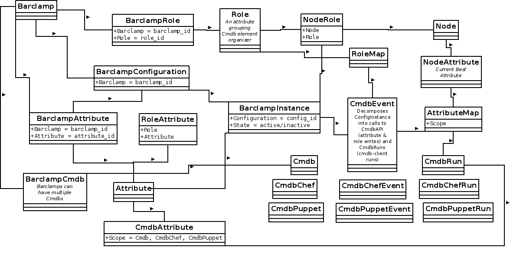

## CB2 Design Topics

_this is intermediate information, not final docs_

Last Updated: 7/5/2013 by Rob Hirschfeld

We’re working on core CB2 functions as per the design discussion
from last week.  Our objective is to code incrementally to validate the
design.  I believe this approach gives the community concrete examples for
discussion and makes it possible to update the design based on learning
and new viewpoints.

Currently, I’ve stripped out a lot of legacy code and
rebuilt the very basics of the model we discussed.  See

This file is located at:
https://github.com/crowbar/barclamp-crowbar/blob/master/doc/devguide/model/crowbar_model.dia

### Script Jig

In the next weeks, we are taking the first steps to define the Jig model API and test it using the Script jig.  Here are some initial thoughts:

The script jig is described here:

* The Script jig is built into the Crowbar barclamp.
* New nodes will be added to the system via the API (POST v2/nodes) not from the jigs
* The jig will provide methods that handle Crowbar node C.U.D. via node_create, node_update and node_delete.
* When new jigs are added, we expect them to get a call to node_create for all nodes already in the system  [we are NOT covering this use case for the Script jig]
* Crowbar will create a “run” handle when it transfers control of node-roles to the Jig for operation
* The Jig will expose a run method that takes the run handle from Crowbar
* When the Jig takes over the run, it will change the run status and also update the node-role states to TRANSISTIONING
* The node-role’s in a run will also have the run handle
* A node-role only be managed by one jig at a time (so a run handle will be per jig)

Crowbar will use "rails runner" to collect a job and hand it off to the Jigs.  
* This will allow the jig to operate without blocking Crowbar threats
* We will be able to run the process manually by disabling the rails runner starts
* We may outgrow this approach, but it is easy to add complexity (like delayed job) after this is working

There will be other items, but this is a good start.
